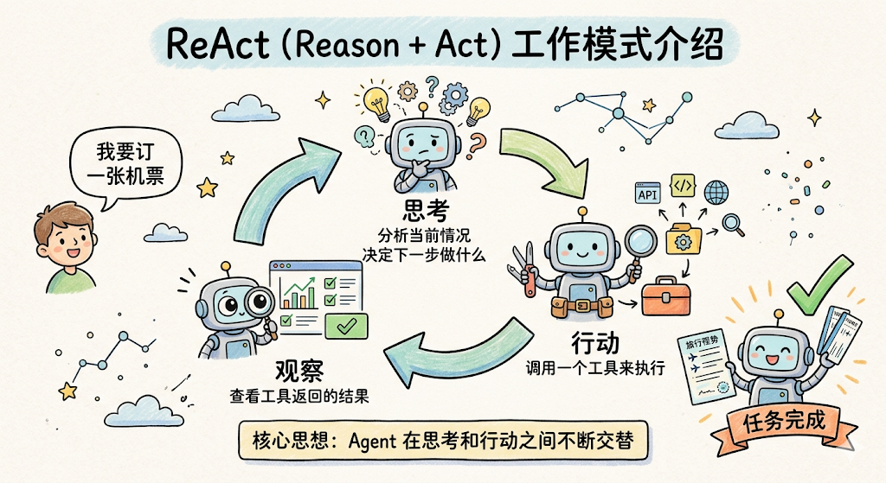
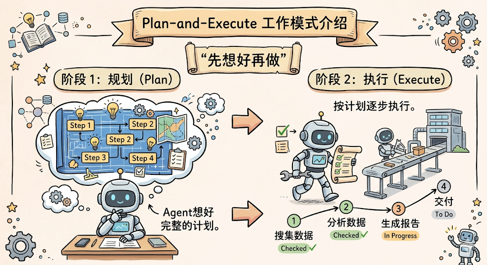
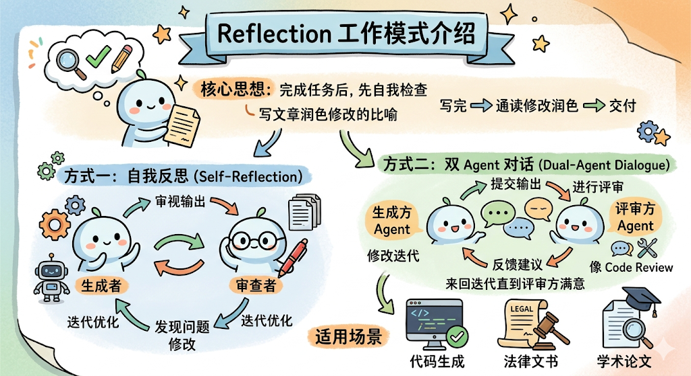
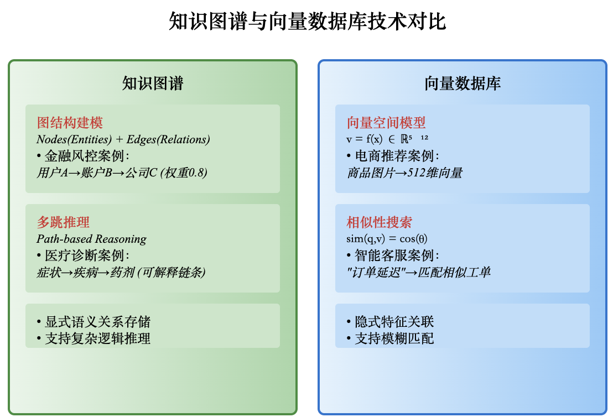
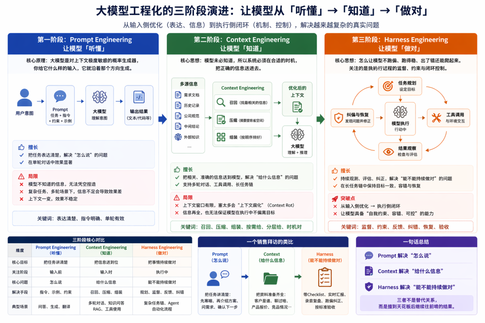
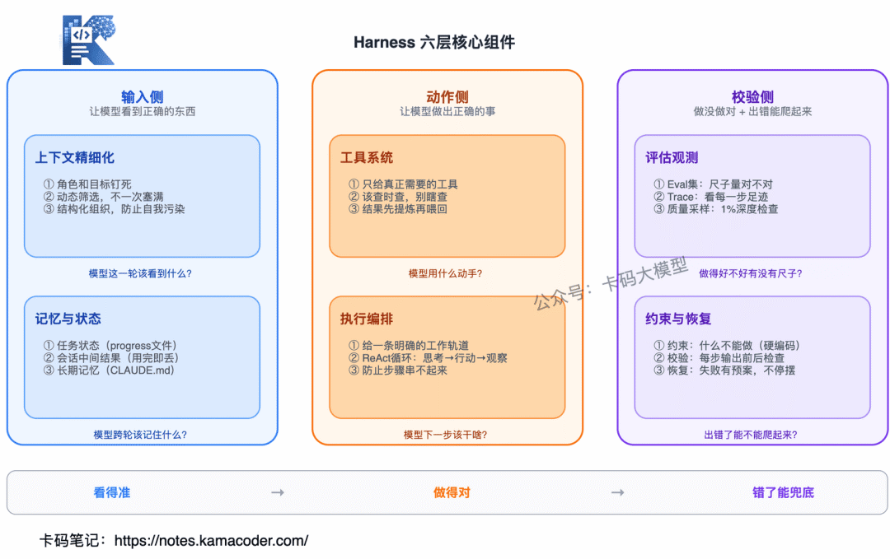
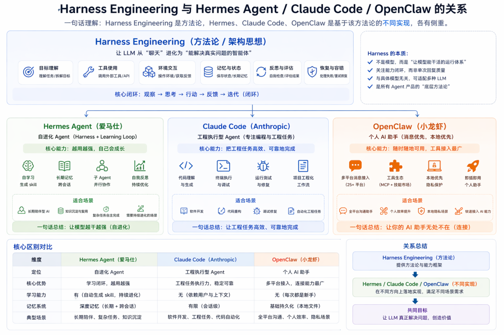

# ***Agent***

## 1.**如何定义一个Agent？它通常由哪些核心组件构成？**

### 1)什么是LLM？

LLM 的工作原理说白了就是「预测下一个字」。你给它一段话，它会根据学到的语言规律，一个字一个字地往后接。

听起来简单，但因为它学的数据量实在太大了，这种「接龙」的效果好到令人吃惊，它能写文章、写代码、做翻译、回答各种专业问题。

### 2）Agent是什么？

Agent翻译叫智能体，Agent就是LLM在循环中自主使用工具的系统

Agent解决LLM弊端：

- 针对"只会说不会做"，Agent 引入了**工具调用**能力，可以调用搜索引擎、数据库、API、代码执行器等各种外部工具来真正执行操作。
- 针对"没有记忆"，Agent 配备了**记忆系统**，包括记住当前任务上下文的短期记忆，和存储在外部数据库中、可以跨对话保留的长期记忆。
- 针对"不会用工具"，业界推出了 MCP 等**标准化协议**来统一工具接入方式，后面会详细讲。
- 针对"不会规划"，Agent 具备了**任务拆解和规划**能力，能把一个大目标分解成多个小步骤，然后逐步执行。


## 2.说下**ReAct**框架。它是如何将思维链和行动结合起来，以完成复杂任务的？  了解**Plan-and-Solve吗 ，Reflection**吗


**React**核心在于智能体 不断重复这个Thought-Action-observation循环，将新的结果追加的历史记录中去，形成一个不断增长的上下文，直到在Thought中认为已达到了正确答案



**Plan-and-Solve**核心分为两个阶段：

​		1）规划阶段 ：将问题分解，制定出一个清晰、分步骤的行动计划

​		2）执行阶段：严格按照计算中的步骤，逐步执行



**Reflection**核心在于执行->反思->优化



## 3.在 Agent 的设计中，“规划能力”至关重要。请谈谈目前有哪些主流方法可以赋予 LLM 规划能力？（例如 CoT, ToT, GoT等）

1）COT思维链

2）TOT思维树

3）GOT思维图


3.1 深入剖析ReAct框架的局限性，并在此基础上，详细解释Plan-Then-Act、ReAct + 轻规划以及Tree/Graph Planning（如ToT、LATS）这三种范式的核心区别、适用场景和各自的优缺点。【待回答】
3.2 请阐述“思维链”（Chain-of-Thought, CoT）与“规划”（Planning）的本质区别。为什么说CoT仅仅是“将推理过程写出来”，而Planning是生成一个“可执行的任务表”？请用具体例子说明。【待回答】

## 4.**Memory**是 Agent 的一个关键模块，如何为 Agent 设计长短时记忆？可以借助哪些外部工具或技术？

短期记忆： 当前任务上下文的“工作记忆”

长期记忆：跨任务、跨会话的持久知识

短期记忆可以借助对话上下文   长期可以借助知识图谱、向量数据库

## 5.Tool Use是扩展 Agent 能力的有效途径。请解释 LLM 是如何学会调用外部 API 或工具的？（可以从 Function Calling 的角度解释）

> **核心思想：工具调用本质是结构化输出**
> 
> LLM 并不是真正"学会"调用 API，而是学会根据上下文生成符合特定格式的输出。

### 工作流程

```
用户输入 + 工具描述 → LLM → 结构化输出 → 执行器调用真实 API
```

### 1. 工具定义（告诉 LLM 有什么工具）

```json
{
  "name": "get_weather",
  "description": "获取指定城市的天气信息",
  "parameters": {
    "city": {"type": "string", "description": "城市名称"},
    "unit": {"type": "string", "enum": ["celsius", "fahrenheit"]}
  }
}
```

### 2. 构造 Prompt（注入到上下文）

系统会将工具定义转换为类似这样的 prompt 注入：

> 你可以使用以下工具：
> - get_weather: 获取天气，参数：city(string), unit(string)
> 
> 如果你想调用工具，请输出：
> `{"name": "工具名", "arguments": {...}}`

### 3. LLM 的"学习"过程

| 阶段 | 说明 |
|------|------|
| **预训练** | 学会了 JSON 格式、函数调用语义、参数推理 |
| **指令微调** | 学习"何时调用"、"如何格式化输出" |
| **上下文学习** | 根据 prompt 中的工具描述，推断如何使用 |

### 4. 示例

- **用户**：北京今天天气怎么样？
- **LLM 输出**：`{"name": "get_weather", "arguments": {"city": "北京", "unit": "celsius"}}`

### 5. 执行闭环

```
LLM 输出工具调用 → 外部执行器调用真实 API → 返回结果 → LLM 继续处理
```

### 关键点

- **不是"学会调用 API"**，而是学会"生成符合格式的文本"
- **工具描述至关重要** — LLM 完全依赖 description 来理解工具用途
- **参数推理是核心能力** — 从用户意图推断参数值
- **微调强化** — 现代 LLM 经专门训练，能稳定输出工具调用格式

> 本质上，Function Calling = **语义理解 + 结构化输出** 的结合


## 6.请比较一下两个流行的 Agent 开发框架，如 LangChain 和 LlamaIndex。它们的核心应用场景有何不同？

**Langchain** 应用编排

**LLamaIndex** 数据与检索框架

## 7.在构建一个复杂的 Agent 时，你认为最主要的挑战是什么？

1）如何做规划与决策

2）长期任务状态管理、记忆

## 8.Agent 的短期记忆和长期记忆应该如何设计和配合？

**短期记忆**= 当前任务的工作内存
**长期记忆**= 所有历史的经验库

短期记忆负责维护当前任务的上下文与推理状态，长期记忆负责提供可检索的知识与经验，两者通过检索与写回形成闭环协同，从而实现既“能思考当下”，又“能积累经验”的智能体系统。

## 9.什么是**多智能体**系统？多Agent 协同相比于单个 Agent 有什么优势？又会引入哪些新的复杂性？

优点：

1)复杂任务拆解能力更强，每个Agent可以专注不同子任务

2）并行化 ，多agent可以并行探索不同解法，效率更高

3）更接近现实建模， 团队协作

缺点：

1）协调与通信成本，

2）决策问题，冲突不一致问题，由单体决策变为分布式系统问题

3）每个agent可能解出的是局部最优解，但是不一定是全局最优解

4）成本问题

## 10.多 Agent 协作时，如何设计 Agent 之间的通信和协调机制？

- 角色分配：每个Agent根据其专长被赋予特定的角色，如数据收集者、分析者等
- 信息共享平台：建立一个中心化的信息交换平台，所有Agent都可以在此发布和订阅相关信息
- 冲突解决策略：设计合理的冲突解决规则，避免因资源竞争导致的任务失败

## 11.当一个 Agent 需要在真实或模拟环境中（如机器人、游戏）执行任务时，它与纯粹基于软件工具的 Agent 有什么本质区别？


## 12.你用过哪些Agent框架？选型是如何选的？你最终场景的评价指标是什么？

LangGraph 将任务拆分为一个由状态、节点和边构成的流程图。
State（状态）：全局共享数据，如记忆、上下文、工具结果。
Node（节点）：每个节点是一个函数 / LLM 调用 / 工具调用。
Edge（边）：定义执行路径、条件判断、循环。

LangChain 简单问答、工具调用、单步决策

## 13.有微调过Agent能力吗？数据集如何收集？

基座模型无法很好的识别特定领域的工具、Agent性能不稳定时也需要开发人员围绕基座模型进行Agent性能方面的微调

1）高效微调 （高效微调的核心在于**数据质量与覆盖度**）

围绕当前Agent特定执行的任务，构造工具调用的微调数据集，让模型学会在同一对话中合理组合多个内置工具，并学会围绕一个问题能确稳定、多步地调用工具。

2）强化学习微调

让模型在真实环境中不断试错和优化，从而提升Agent性能。例如我们可以将工具调用的准确率、任务完成率、调用链条的合理性作为奖励函数，引导模型学会更高质量的交互。

## 14.如果要开发Agent,应该要怎么开发？

答：
核心流程：

- 定义能力边界（能做，不能做）
- 设计推理循环（思考->行动->观察->再思考）
- 输出结构化结果（减少自我发挥）

伪代码:

```
Agent:={
  Role:角色声明
  Description:告知能力（可调用的工具）
  Instruction:明确职责
  Config:{
    最大轮次
    超时控制
    输出格式
  }
}
```


# ***RAG***


## 1.请解释 RAG 的工作原理。与直接对 LLM 进行微调相比，RAG 主要解决了什么问题？有哪些优势？

RAG在大语言模型前先访问数据库（向量数据库或者知识图谱库），从数据库中检索出相符的文本或者向量，做一个提示词增强然后输入给LLM。

- 一定程度上解决了模型的幻觉问题
- 可以接入本地知识库（私有库）

## 2.RAG 怎么解决 LLM 上下文窗口有限的问题？


## 3.Function Call，MCP了解么


图中4是function call

```
函数调用
functions = [{
    "name": "get_weather",
    "parameters": {
        "type": "object",
        "properties": {
            "location": {"type": "string"}
        }
    }
}]
```

```
MCP插件
{
  "mcpServers": {
    "filesystem": {
      "command": "npx",
      "args": ["-y", "@modelcontextprotocol/server-filesystem", "/Users/me/data"]
    },
    "github": {
      "command": "npx",
      "args": ["-y", "@modelcontextprotocol/server-github"],
      "env": {
        "GITHUB_TOKEN": "your-token"
      }
    }
  }
}
```


## 4.Websocket和SSE区别是什么

​	SSE是单向通信，是由服务端发送客户端的。目前主流LLM对话基于SSE

​	WebSocket是双向通信

## 5.一个完整的 RAG 流水线包含哪些关键步骤？请从数据准备到最终生成，详细描述整个过程

​	第一阶段：数据准备

​	1）数据采集与加载——收集构建知识库所需的源数据，如PDF、Markdown、数据库记录、网页、Notion文档等。

​	2）文档解析与预处理——将原始二进制数据（如 PDF 图片）转换为纯文本，并进行清洗

​	3）智能分块——将长文档切分成更小的分段

​	4）向量化（嵌入）——调用嵌入模型（Embedding Model），将文本块转换为高维向量。

​	5）数据存储与索引构建——将生成的向量及元数据存入向量数据库，如（Pgvector）

​	第二阶段：查询阶段

​	1）查询理解——对用户的输入进行预处理

​	2）检索，使用用户的问题在向量数据库中进行搜索

​	3）重排序对检索到的Top-K结果重新打分和排序	

​	4）上下文构建与提示词工程

​	5）生成与输出


## 6.在构建知识库时，文本切块策略至关重要。你会如何选择合适的切块大小和重叠长度？这背后有什么权衡？

在RAG系统里调切块参数，说白了就是要在“搜得准”和“看得全”之间做取舍。

**块越小**，每个片段的内容越单一，向量化后语义更集中，检索时匹配更精准；但缺点也很明显——信息容易被截断，大模型拿到的只是零散的片段，缺少上下文，反而可能理解偏差或瞎编。

**块越大**，上下文保留得越完整，模型推理时占便宜；但问题在于，一个块里可能混进多个不同的话题，向量变成“大杂烩”，检索时容易带回一堆不相关的内容，同时每个块占用的上下文窗口也更大，一次能塞进去的块数就少了。

工程上通常拿 **512 token** 当起点。如果是FAQ这类问题，场景简单，用 **256** 左右更合适；如果是需要深度理解的复杂任务，可以放大到 **1024**，然后根据实际效果慢慢调。

**重叠（overlap）** 的作用，是缓解块与块之间在边界处被硬生生切断带来的语义丢失。一般按块大小的 **10%~25%** 来设。重叠太小，衔接效果不明显；重叠太大，既浪费存储，又会造成检索结果大量重复。不过说到底，overlap 只是对“按固定长度硬切”这种粗糙方式的一种补救。更好的做法是根据文档本身的规律来切——比如根据语义变化幅度自动切分，或者顺着文档原有的标题、段落结构来拆。

在实际项目中，我常用 **多级索引** 的思路：用小块来做精细检索，保证命中率；检索到之后再把它对应的大块喂给模型，这样检索和生成两头都能拿到最适合自己的粒度。

最后一点，切块参数不能靠感觉拍板，得结合你用的 Embedding 模型支持的最佳输入长度，通过 **召回率** 和 **生成质量** 两项评估指标来反复验证和调优。

参考：https://golangstar.cn/backend_series/llm_interview/chunk.html

## 7.如何选择一个合适的嵌入模型？评估一个 Embedding 模型的好坏有哪些指标？

### 选型实战：

1. **任务与数据领域**
   - **通用领域**（客服、通用问答）：选择通用模型，如OpenAI的`text-embedding-3-small`或开源的`bge-large-en-v1.5`。
   - **专业领域**（医疗、法律）：优先选择领域预训练模型，如医疗领域的**BioBERT**，或法律领域的**Legal-BERT**，它们在专业术语上的理解力远超通用模型。
   - **多语言/中文场景**：
     - **中文为主**：推荐 `bge-large-zh-v1.5`（效果最佳）或 `bge-base-zh-v1.5`（性价比高）。
     - **多语言混合**：首选 **BGE-M3**，它支持超过100种语言，并且有8K的长下文窗口。
2. **上下文窗口与文本长度**
   - 如果你的文档很长（如学术论文、法律合同），务必选择支持**8K tokens**以上窗口的模型，如 **BGE-M3** 或 OpenAI的`text-embedding-3-large`。否则，模型会因为看不到全文而丢失关键信息。
3. **向量维度与计算资源**
   - **高维向量**（>1536维）：信息承载量大，精度更高，但消耗更多存储和计算资源。
   - **低维向量**（384-768维）：更轻量，检索速度快，适合资源受限或对实时性要求极高的场景。
4. **成本考量**
   - **API调用**：如OpenAI，按token付费，前期投入低，适合快速原型验证和小规模应用。
   - **自托管**：如Hugging Face上的开源模型，前期有硬件和部署成本，但在大规模生产环境中，长期总拥有成本（TCO）更低，数据也更安全。
5. **基准测试与落地验证**
   - **初筛**：在 [MTEB 排行榜](https://huggingface.co/spaces/mteb/leaderboard) 上查找在你关注的任务（如“Retrieval”）上评分较高的模型。
   - **终验**：**一定要用你的真实数据做小范围测试**。因为公开数据集的分布和你的私有数据分布可能完全不同，这一步是检验模型真实效果的试金石。

### 评价指标：

1. **语义相似度与检索准确率**
   - **是什么**：衡量模型对语义理解的准确性，是否能找到意思相近的内容。
   - **常见指标**：**召回率**（找回了多少真正相关的内容）、**平均倒数排名**（MRR，评估最相关结果的排位是否靠前），以及经典的**Spearman相关系数**（评估模型给出的相似度分数与人类判断是否一致）。
2. **MTEB (Massive Text Embedding Benchmark) 基准评分**
   - **是什么**：目前业界最主流的“标准试卷”，通过58个数据集、6大类任务（如语义搜索、分类、聚类等）来综合打分。
   - **怎么用**：MTEB排行榜是选型的**重要起点**。但要注意，高分不等于在你的专属业务上表现也好，它更多是模型综合实力的体现。
3. **模型规模与推理效率**
   - **是什么**：模型的参数数量和向量维度，直接决定了运行速度和资源消耗。
   - **关键数据**：
     - **轻量级模型**（如`b1ade-embed`, `bge-base-zh-v1.5`）：参数量在3亿左右，速度快、资源占用少，适合对延迟敏感的场景。
     - **重量级模型**（如`NV-Embed-v1`, `Mistral-7B`）：参数量超过70亿，精度更高，尤其在处理长文本时优势明显，但需要强大的GPU支持。
4. **鲁棒性与抗干扰能力**
   - **是什么**：模型在面对文本中的微小噪音（如错别字、语序微调）时，能否保持稳定，不产生剧烈波动。
   - **高要求场景**：如果你的数据来自用户生成内容（UGC），存在大量不规范输入，这个指标就非常关键。
5. **信息敏感性**
   - **是什么**：模型区分关键信息和细微差别的能力。例如，它能分辨出两份相似报告中，一个提到了“疑似肿瘤”，而另一个明确是“良性囊肿”这种对决策有重大影响的差异。


## 8.除了基础的向量检索，你还知道哪些可以提升 RAG 检索质量的技术？


## 9.如何全面地评估一个 RAG 系统的性能？请分别从检索和生成两个阶段提出评估指标


## 10.在什么场景下，你会选择使用图数据库或知识图谱来增强或替代传统的向量数据库检索？

​	**知识图谱与向量数据库**作为两类主流技术，分别以**关系推理**与**语义相似性**搜索为核心能力。

​	**从数据建模上看**	

​		1）知识图谱采用图结构数据模型，通过节点和边构建语义网络。

​		2）向量数据库则依赖向量空间模型，将文本、图像等非结构数据转换为高维向量。

​	**从检索机制上**

​		1）知识图谱通过图遍历算法实现多跳处理。例如医疗场景中，症状A-引发-疾病-需要-药剂C 来推荐治疗方案

​		2）向量数据库则依相似性度量算法（如余弦相似度）实现模糊匹配。

​		

**从应用场景来看**

​	知识图谱适用于"**推理性**”场景

​		# 金融风控：构建 “企业 - 股东 - 关联交易” 关系网络，某银行通过此技术发现 37 起潜在关联交易风险。

​		# 医疗诊断：将患者症状与医学知识库匹配，某 AI 辅助诊断系统误诊率下降 65%

​	向量数据库适用于“**检索型**”场景

​		# 多模态搜索：支持 “图片搜商品” 功能，某电商平台转化率提升 22%

​		# 大模型外挂：通过 RAG 技术为 LLM 提供实时知识支持，某客服机器人事实性回答准确率从 75% 提升至 92%


## 11.传统的 RAG 流程是“先检索后生成”，你是否了解一些更复杂的 RAG 范式，比如在生成过程中进行多次检索或自适应检索？


## 12.RAG 系统在实际部署中可能面临哪些挑战？


## 13.什么是RAG中的"幻觉"问题？如何预防？

​	大模型幻觉	

​		大模型本身在生成文本时，会产生与事实不符、无依据或编造的内容。这是模型的固有问题。

​	RAG幻觉

​		在RAG架构中，由于检索信息与模型生成之间的错配，导致模型仍然产生幻觉的现象。这是幻觉在RAG场景下的具体表现。

## 14.GraphRAG与传统RAG有什么区别？

1. GraphRAG与传统RAG的核心区别在于：**传统RAG将知识视为孤立的文本片段，而GraphRAG将知识构建成相互关联的实体网络，实现关系感知的检索与推理**。

   我把它们的核心区别整理成了一张对比表，方便你快速理解：

   | 对比维度     | 传统RAG (Vector RAG)                                         | GraphRAG                                                     |
   | :----------- | :----------------------------------------------------------- | :----------------------------------------------------------- |
   | **知识表示** | 将文档切分为**非结构化文本块**，通过向量表示语义             | 构建**知识图谱**，用**节点**（实体）和**边**（关系）表达结构化知识 |
   | **检索机制** | **语义相似性检索**。将查询向量化，在向量库中匹配最相似的文本块 | **关系遍历检索**。定位相关实体节点，沿关系边进行多跳遍历，获取子图 |
   | **核心能力** | 擅长**事实查找**和**主题归纳**，适合单文档或跨文档的简单问答 | 擅长**多跳推理**和**关系分析**，能追溯复杂问题的完整逻辑链路 |
   | **可解释性** | 提供相关的文本片段作为依据，但证据链较弱                     | 可展示完整的**推理路径**（实体A→关系→实体B→...），证据透明可追溯 |
   | **实现成本** | **较低**。流程简单：文档分块 → 向量化 → 存储                 | **较高**。需额外进行实体抽取、关系构建和图谱维护             |
   | **适用场景** | 开放域问答、FAQ机器人、文档摘要等                            | 复杂推理、全局性分析、合规调查、供应链追溯等                 |

   ------

   ### 📌 深入理解：为什么GraphRAG能解决传统RAG的痛点？

   传统RAG在处理复杂问题时，往往会遇到一个核心瓶颈：**信息碎片化**。例如，当被问到“A公司收购B对C有什么市场影响？”时，答案可能分散在多个文档中，而传统RAG检索到的孤立文本块很难串联起“A→收购→B→影响→C”的完整因果链。

   GraphRAG正是为了解决这个问题而生，它的核心优势体现在：

   1. **强大的多跳推理能力**
      GraphRAG将信息表示为相互连接的图。当收到一个问题时，它能够像沿着路标行走一样，从一个实体跳到另一个相关的实体，遍历整个关系链，从而找到最终答案。NVIDIA的实验数据表明，GraphRAG在需要多跳推理的专业领域问答中，准确率（Hits@1）可以达到传统基线的**两倍以上**（32% vs 15.57%）。
   2. **显著降低的“幻觉”风险**
      由于GraphRAG的检索过程是基于明确、可追溯的关系路径，它能向大语言模型提供更精准、上下文更完整的知识。这大大减少了模型因为信息不足而“编造”答案的可能性，使生成的内容严格依据事实。一项2023年的基准测试显示，GraphRAG在回答企业级问题时，整体准确率比无知识图谱的LLM提升了**3.4倍**（从16.7%提升到56.2%）。
   3. **无与伦比的全局信息感知能力**
      传统RAG只能“看到”与问题最相似的一小部分文本块，难以回答需要总结整个数据集或发现宏观趋势的问题。GraphRAG可以通过“社区检测”等技术，将关联紧密的实体归为一组并生成摘要，从而让系统具备回答“这份财报中，各地区业务表现的整体趋势是什么？”这类全局性问题的能力。

   ### 🤔 如何选择？

   你可能会问，既然GraphRAG这么强大，是不是可以完全替代传统RAG了？

   答案是否定的。**选择哪种技术，取决于你的具体应用场景和核心诉求**。

   - **优先选择传统RAG，如果你的需求是：**
     - **快速起步**：需要快速搭建一个原型或MVP（最小可行产品）。
     - **简单问答**：处理FAQ、单文档问答或摘要类任务。
     - **资源有限**：对延迟敏感，或没有预算进行复杂的图谱构建和维护。
   - **果断采用GraphRAG，当你的场景是：**
     - **复杂推理**：问题需要跨越多份文档，涉及多步逻辑（如“找出所有与X公司有合作，并且其产品存在安全隐患的供应商”）。
     - **关系分析**：核心在于理解事物之间的联系（如金融风控中的资金链路追踪、供应链影响分析）。
     - **高精度要求**：对“幻觉”零容忍，需要答案的每一个环节都可追溯、可验证（如医疗、法律、合规审查）。

## 15.如果RAG系统返回0个检索结果，你会如何排查问题？


## 16.了解Transformer 吗？


## 17.准确率和召回率的区别？

- 召回率（Recall）：所有相关文档被检索出来的比例=检索到的相关内容数/总相关内容数。召回率低，意味着关键参考缺失，容易产生幻觉或回答不全。
- 精准率（Precision）：检索结果中真正相关的比例=检索到的相关内容数/总检索内容数。精准率低会引入无关内容，浪费token并干扰判断。
  优化方法：
- 提升召回率：混合检索、分块优化、同义词扩展
- 提升精准率：重排序、阈值过滤、语义去重
- 目标：召回率：> 90 % , 精准率 > 85 %

## **18.什么是“混合检索”（Hybrid Search）？请解释为什么在工业级RAG系统中，纯向量检索往往不够用，需要结合关键词检索（如BM25）。请给出一个具体的业务场景，说明混合检索的必要性。**


## 19.在处理一个需要多步工具调用的复杂任务（例如“调研三篇关于RAG+RL的论文并输出中文总结”）时，如何设计一个鲁棒的规划机制来应对中间步骤的失败（如某个API调用超时或返回数据格式错误）？请描述具体的重试、回滚或重规划策略。


# ***调优***

## 1.如何保障调用模型API的健壮性和并发性？

- 健壮性：统一调用封装；分场景超时与指数退避重试；降级到备用模型；熔断与限流；非核心任务异步化。
- 并发性：模型请求池与业务请求池隔离；高频结果缓存；分布式锁避免重复调用。

## 2.第三方模型超时如何处理？

- a.差异化超时，实时反馈并提示用户；
- b.缓存兜底，保证主流程不中断；
- c.非实时任务入队异步重试，结果补发；
- d.监控警告与定位；
- e.触发轻量限流削峰；

添加超时控制、重试机制与基础降级策略，必要时引入熔断器与监控大

## 3.在Agent推理过程中，经常会出现“推理断层”或“结果与目标偏离”的问题。请结合具体技术或你的实践经验，说明如何通过提示工程、记忆机制或架构设计来缓解或解决这一问题。【待回答】


## 4.当历史对话记录非常长时（远超模型上下文窗口），你有哪些策略来优化记忆的查询效率并保证关键信息不丢失？请比较“滑动窗口”、“总结压缩”、“向量检索”等不同方案的优劣。【待回答】

- 滑动窗口：Redis维护短期记忆（近5论对话历史），适配长流程
- 记忆压缩：设定阈值，超过阈值后调用 阈值前的对话，保留摘要但丢失细节
- 分层记忆： …

# ***Skills***

***可以理解为操作经验，规定在什么场景下按照什么顺序，组合使用那些工具***

***这里的工具可以是MCP插件，也可以是本地script脚本***

skills在一定程度可以理解为大模型驱动的workflow，灵活性更高


**元数据metadata**（只含有精简信息，可减少发送给LLM的token量）


**多个skills（元数据）发送给大模型**，LLM判断用哪个


**完整流程：**


1）用户发送问题给cc   （用户提示词）

2）cc将问题+多skills（只包含元数据）一起发送LLM

3）LLM判断执行哪个skill

4）cc将整个skill（脚本文件，md文件）发送LLM

5）LLM下达指令 用什么脚本，执行什么工具

6）cc执行完发送结果到LLM

7）LLM整理得到返回给cc

8）返回给用户


# ***Harness Engineering***

让大模型持续按规范执行任务


## 三阶段：

### **第一阶段：Prompt Engineering——让模型"听懂"**

大模型本质上是一个**对上下文极度敏感的概率生成器**。你给它什么样的输入，它就沿着那个方向生成。你给它一个角色身份，它就用那个角色的思路回答；你给几个示例，它就沿那个范式补全；你强调什么约束，它就把那个约束当重点。

所以同一件事，换个说法效果能差十倍。"加个排序"可能给你一段没头没尾的代码片段，但"这是完整代码，帮我加按年龄从大到小的排序，保留所有逻辑，输出完整代码"就能给你靠谱的结果。

Prompt Engineering 解决的核心问题就一个：**模型不是不会，而是你没把话说明白。**

它在单轮对话场景里很好用。但很快，大家想做的事情变复杂了，提示词工程就撑不住了——你让大模型"分析公司财报"，它没看过你的财报，分析啥？你让它"按公司代码规范写功能"，它没看过你的规范，怎么知道该怎么写？

**提示词擅长把任务表达清楚，但不擅长凭空补出模型不知道的知识。** 它解决的是"表达"的问题，不是"信息"的问题。

### **第二阶段：Context Engineering——让模型"知道"**

为什么 Context Engineering 会火？因为大家做的产品形态变了。之前是聊天机器人，问一句答一句。后来 Agent 火了，模型要进真实环境去"干活"——多轮对话、调用工具、写代码、查数据库，要在多个步骤之间传递中间结果。

一个完整的任务，模型至少需要拿到：当前的需求文档、历史评审记录、公司相关规范、当前任务的具体目标、之前分析的中间结论。这些东西全部加起来，才叫一个完整的"上下文"。

Context Engineering 的核心思想就一句话：**模型未必知道，所以系统必须在合适的时机，把正确的信息送进去。**

但上下文窗口是有限的。更要命的是，上下文塞得太满，模型会出现**"上下文腐化"**（Context Rot）——记不住前面内容，前后矛盾，忽略最初定下的规则。像被信息淹没的人，你给他太多东西要看，反而抓不住重点。

所以 Context Engineering 要做三件事：**召回**（找最相关的信息）、**压缩**（摘要提炼省空间）、**组装**（按顺序排好，重要的放后面）。

Anthropic 的 Agent Skills 就是这个思路——一开始只给模型看"目录"，等它真的需要某个工具时再动态加载详细说明。上下文优化的本质不是"给得更多"，而是**"按需给、分层给、在正确的时机给"**。

### **第三阶段：Harness Engineering——让模型"做对"**

你把提示词写得再漂亮，把上下文管得再完美，模型在单步上的表现确实越来越好。但只要任务的链路一长，还是会出问题：

- 计划做得很好，执行时突然跑偏
- 调用工具调对了，但理解错了返回结果
- 在长任务链里悄悄偏离初衷，系统完全没察觉
- 跑着跑着忘了自己最初要干啥

提示词优化的是"意图表达"，上下文优化的是"信息供给"，但这两个都还停留在**输入侧**。当模型真正开始连续行动时，会出现一个全新的问题：**谁来监督它？谁来约束它？谁来在它跑偏时把它拉回来？**

这就是 Harness Engineering 要解决的问题。前两代工程关注的是"怎么让模型更会想"，Harness 关注的是**"怎么让模型不跑偏、跑得稳、出了错还能爬起来"**。



## Herness核心组件

面试官会问："如果让你设计一个 Harness，你里面会装什么？"

去看 **OpenAI、Anthropic、LangChain** 这些做 Agent 的顶级团队，产品形态不同、技术栈不同，但把 Harness 掀开看内部结构，组件惊人地相似。因为"让 Agent 在真实世界稳定工作"这个命题，天然推着所有人往**同一方向收敛**。

一个成熟的 Harness 大致可以拆成**六层**，按"它在干啥"分成三组：



**输入侧**（让模型看到正确的东西）：上下文精细化管理 + 记忆与状态管理

**动作侧**（让模型做出正确的事）：工具系统 + 任务执行编排

**校验侧**（让模型知道做没做对 + 出错能爬起来）：评估观测 + 约束恢复


### **第一层：上下文精细化**

这一层管的是"空间"——**这一轮发给模型的那一坨上下文，长啥样、装了些啥、怎么排布**。它容易和第四层（记忆与状态）搞混，区别是：第一层管"这一轮看到什么"，第四层管"上一轮的事怎么流到下一轮"。

核心做三件事：

**① 把角色和目标钉死。** 大部分 Agent 跑偏，根源是身份没说清楚。模型得知道自己是谁、当前任务是啥、成功标准是什么。

**② 动态筛选，不是一次塞满。** Anthropic 把这个叫"just-in-time retrieval"——让 Agent 边干活边按需抓信息，而不是一上来把所有可能有用的东西一股脑塞进去。塞得越多，注意力越散。

**③ 结构化组织。** 固定规则放一处，动态证据放一处，中间结论放一处，三者分开。否则模型会"自我污染"——用前面错的中间结论去影响后面判断。

### **第二层：工具系统**

没有工具的大模型就是个文本预测器。接上工具之后，Agent 才真正活过来。但工具不是接得越多越好。

OpenAI 做Codex早期踩过这个坑：一开始给 Agent 接了一堆工具，想着"选择多总是好的"，结果 Agent 频繁用错工具、用错时机。后来砍掉一大半，效果反而上去了。

这一层要回答三个问题：**给它哪些工具**（只给真正需要的）、**什么时候用哪个**（该查的时候查，不该查的时候别瞎查）、**工具结果怎么喂回模型**（30条搜索结果别原样塞回去，先提炼再喂）。

MCP（Model Context Protocol）本质上就是在做工具层的标准化，让任何工具都能用同一种方式接到任何 Agent 上。

### **第三层：执行编排**

Agent 的本质，说白了就是一个 **for 循环**：思考一步 → 行动一步 → 观察结果 → 再思考下一步。经典名字叫 ReAct（Reasoning + Acting）。

但魔鬼藏在这个循环里。Agent 经常翻车的场景是：每一步它都会做，但把所有步骤串起来之后就不会了。它知道拉数据、知道写摘要，但不知道应该先拉全量再逐个分析，最后交付给你的经常是一堆半成品。

这一层的职责就是**给模型一条明确的工作轨道**，让它知道"我现在在哪一步，下一步该干啥"。

### **第四层：记忆与状态**

没有状态管理的 Agent，每一轮调用之间都是失忆的。今天跑了一遍，明天再跑完全不记得"这个任务昨天已经处理过了"，于是又处理一遍。

Anthropic 给出了一个关键做法：**Agent 的状态不应该放在上下文窗口里，而应该外化到文件系统。** 让 Agent 维护一份进度日志、一份启动脚本、一个完整的 git history，作为"长期记忆介质"。下一轮换一个全新的上下文窗口接手时，从这些文件里一读，立刻就知道"现在到哪一步了"。

记忆必须分层存：**任务状态**（写到 progress 文件里，任务完就归档）、**会话中间结果**（当轮用完就丢）、**长期记忆**（写在常驻配置里，每次调用都注入）。三类记忆生命周期完全不同，混在一起就乱了。

Claude Code 里的 CLAUDE.md、Cursor 里的 .cursorrules，就是"长期记忆"这一类的典型实现。

### **第五层：评估与观测**

这一层最容易被跳过，但跳过之后就进退两难。

太多团队做出 Agent 高高兴兴上线，跑了两周才发现实际成功率只有 50%——不是它不出结果，而是它每次都出结果，但一半时候是错的。这两周里没人发现，因为根本没有机制能告诉团队"它这次到底做得对不对"。

两件事：

**Eval 集**——手写一批典型任务，每个标注"正确答案长啥样"，每次改完 Agent 就跑一遍，对比成功率。没有 Eval 集，你对 Agent 好不好的判断永远停留在"我感觉这次变好了"的玄学阶段。

**Trace**——看到 Agent 每一步的真实足迹：做了什么决策、调了哪个工具、拿到什么返回、花了多少 token。LangSmith、Langfuse 这类 trace 系统就是干这个的。能看到 trace，调试就从"猜"变成了"看"。

### **第六层：约束与恢复**

在真实环境里，失败不是例外，是常态。这一层做三件事：

**约束**——定义"什么事 Agent 不能做"。这些约束最好硬编码到代码或 linter 规则里，而不是写在提示词里靠 Agent 自己遵守。

**校验**——在每一步输出前后做自动检查。格式对不对？频道名在不在白名单里？校验不是审美品味，是硬规则。

**恢复**——失败之后有预案。API 限流就等一会重试；发送失败就先落本地队列；token 快耗光就立即停下保存进度。每种典型失败都应该有明确恢复路径。

## 五个真实难题

### 难题一：Agent 跑久了为什么会越走越偏？  重启开一个新终端


### 难题二：让 Agent 自己给自己打分，为什么总偏乐观？  让干活的和验收的，必须是不同的人。


### 难题三：Agent 反复失败，工程师到底该干啥？

​	当 Agent 反复失败时，绝大多数人的本能反应只有两个：再调调提示词，或者换个更强的模型。但 OpenAI 在做 Codex 项目时	发现，这两招其实都是错的方向。

他们干了一件很离谱的事：在百万行代码项目里，人类工程师几乎不写代码，全部由 Agent 来写。那人在干啥？**三件事**：

- 把产品目标拆成 Agent 能力边界内的小任务；
- 当 Agent 反复失败时看"环境里缺了什么能力"然后补进去；
- 建立反馈链路让 Agent 看到自己的工作结果。

以前遇到 Agent 写代码有 bug，加一句提示词"请仔细检查代码不要有 bug"，祈祷模型听话。Codex 团队的做法是：给 Agent 接上 lint、单测、运行环境，让它自己写完自己跑，看见 bug 自己改。同样的问题，前者在求模型发挥，后者在改造环境。

**原则：Agent 反复失败时，别问模型能不能更努力，要问环境还缺什么。**


### 难题四：规范文件越写越长，Agent 为什么反而更糊涂？

OpenAI 自己踩过的坑。早期做 Codex 时搞了一个巨大的 AGENTS.md，把所有规范、约定、最佳实践全塞进去。想法是：规则写得越全，Agent 越不会出错。结果呢？Agent 更糊涂了——上下文窗口是稀缺资源，文件越来越长，模型注意力被严重稀释。

OpenAI 后来怎么改的？把 AGENTS.md 从"百科全书"改成"目录页"——主文件只保留约 100 行核心索引，详细内容拆到子文档里。Agent 平时只看目录，真的需要某部分时才钻进去。这就是**渐进式披露**（Progressive Disclosure）——上下文优化的本质不是"给得越多越好"，而是"该给的时候给，不该给的时候藏起来"。

如果你现在在写 CLAUDE.md 或 Cursor Rules，强烈建议回头看看自己有没有"百科全书化"。如果有，赶紧拆。

**原则：规则文件宁缺毋滥，给模型看的东西少即是多。**


### 难题五：Agent 写的代码越堆越烂，技术债怎么还？

这个特别接地气。Agent 负责写绝大多数代码后，会疯狂模仿仓库里已有的模式——好的被复制，坏的也被复制。一旦早期某段代码写歪了，Agent 把那个歪写法当"惯例"，越堆越歪。OpenAI 给它起了个扎心的名字：**AI slop（AI 代码泔水）**。

OpenAI 一开始的办法是靠人工清理——每周拿出周五一整天让工程师手工打扫。结果失败了：Agent 产出代码的速度太快，人类清理的速度跟不上，周五清一天，周一又堆满了。

最后的解法非常 Harness：**把工程师的经验写成"黄金原则"（Golden Principles）沉进仓库**，然后让一批后台 Agent 按固定节奏自动扫描仓库，找出偏离的地方，自动开修复 PR。大部分修复 PR 一分钟审完直接 auto merge。技术债从"一周一次人工清扫"变成了"每天持续自动偿还"。

OpenAI 原文里有一句话特别准：**技术债就像一笔高利息贷款，几乎永远应该每天小额还一点，而不是攒着等某一天集中还。**

**原则：技术债不是攒一堆集中还，而是每天让后台 Agent 自动偿还一点。**


## 面试题

### Hermes Agent vs OpenClaw：两种 Harness 实现

              ┌────────────────────┐
              │ Harness Engineering │  ← 方法论（抽象层）
              └─────────┬──────────┘
                        │
         ┌──────────────┼──────────────┐
         │              │              │
     Hermes Agent   Claude Code     OpenClaw
     （实现A）       （实现B）       （实现C）


### 和 Prompt/Context Engineering 到底什么关系？

三者根本不是替代关系，而是**包含关系**：

- Prompt 是对"指令"的工程化
- Context 是对"输入环境"的工程化
- Harness 是对"整个运行系统"的工程化

边界一层比一层大。**Prompt 是 Context 的一部分，Context 是 Harness 的一部分。** 当你做 Harness 的时候，里面一定包含 Context 工程，Context 工程里又一定包含 Prompt 工程。

### **四层递进**

如果你把 Hermes Agent 的学习闭环也加进来，可以看成四层递进：

| 层次                | 解决什么   | 一句话             |
| :------------------ | :--------- | :----------------- |
| Prompt Engineering  | 怎么说     | 让模型听懂你想干啥 |
| Context Engineering | 给什么信息 | 让模型知道该用什么 |
| Harness Engineering | 能干什么   | 让模型持续做对     |
| Learning Loop       | 会不会变强 | 让模型越干越强     |


### **Agent = Model + Harness 这个等式你怎么理解？**

除了模型本身之外，几乎所有决定 Agent 能不能稳定交付的东西都属于 Harness——工具、上下文文件、记忆系统、评估机制、约束规则、恢复策略。换模型提升的是天花板，搭 Harness 提升的是**落地能力**。在**模型迭代速度放缓的今天**，Harness 这部分的提升空间可能比你想象的大得多。


### **Context Engineering 和 RAG 是什么关系？**

RAG 是 Context Engineering 的一种具体实现技术——它解决"召回"这一步（从大量文档中找出最相关的）。Context Engineering 还包括压缩（摘要提炼）和组装（按顺序排布），RAG 只管了第一步。


### **Agent 跑久了上下文腐化怎么办？**

三步：先做上下文压缩（摘要提炼历史对话，腾出空间），如果压缩还不够（模型带着"疲惫感"），做 Context Reset（整个上下文窗口丢掉，换干净的，状态从文件系统恢复），关键是状态必须外化到文件而不是留在上下文窗口里。


### **AGENTS.md 越写越长效果变差怎么办？**

改成渐进式披露：主文件只保留核心索引（OpenAI 建议约 100 行），详细规则拆到子文档，Agent 按需加载。这和 Anthropic 的 Agent Skills 是同一思路——不一开始塞所有信息，而是需要时才动态注入。


# *思考*

如何提高高质量的知识库？

如何提高文档解析的准确率？ 尤其是复杂PDF 、扫描件、表格混合内容

如何设计分块策略，避免信息割裂？

如何优化向量化过程，提高检索召回率？

如何提高多跳检索、重排序、查询拓展来提高答案准确率？

如何通过Prompt工程引导模型输出结构化结果？

如何搭建一个具备规划、工具调用、记忆能力的Agent系统？


# *参考文献*

1、B站 小白debug

2、代码随想录

3、JavaGuide
